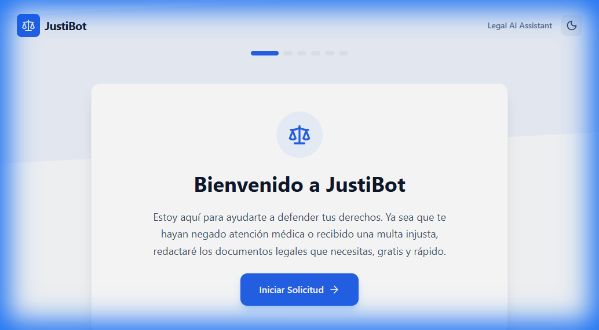
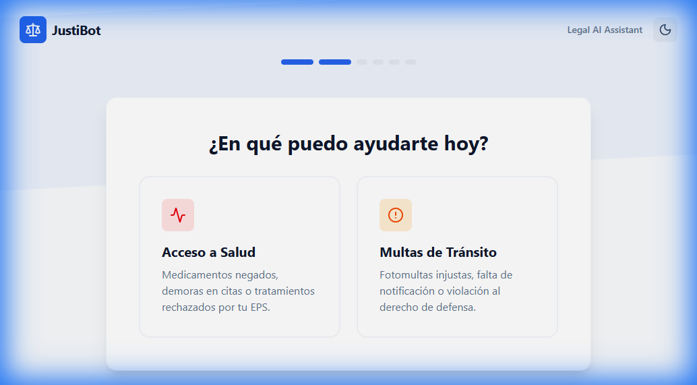

# ⚖️ JustiBot

> **Made in Colombia 🇨🇴** | **Educational Project (Proof of Concept)**

   

## 🇨🇴 Context: Democratizing Justice
**JustiBot** was born from a real need in **Colombia**: access to justice is often costly and complex for the average citizen. Many people do not know how to draft an **Acción de Tutela** (Tutela Action) to claim fundamental rights like health, or a **Derecho de Petición** (Right of Petition) to request information from public entities.

This project is an authentic initiative to explore how **Artificial Intelligence** can bridge that gap, allowing any Colombian to generate legal drafts simply by describing their problem in natural language.

> [!WARNING]
> **IMPORTANT - LEGAL DISCLAIMER**
> This project is a **Low-Scale Educational Prototype**.
> *   **It is NOT professional legal advice.**
> *   The generated documents are **drafts** based on generalist language models.
> *   The system **does not have exhaustive constitutional validation** nor does it replace a lawyer.
> *   Use only for testing and learning purposes.

---

## 🚀 Quick Start

### Prerequisites
*   [Docker](https://www.docker.com/) installed and running.
*   A Google Gemini API Key (Free).

### Run with Docker (Recommended)

1.  **Clone the repository**:
    ```bash
    git clone https://github.com/YOUR_USER/justibot.git
    cd justibot
    ```

2.  **Configure Environment Variables**:
    Create a `.env` file in the `backend/` folder and paste your key:
    ```bash
    # In backend/.env
    OPENAI_API_KEY=your_api_key_here
    ```

3.  **Run the project**:
    ```bash
    docker-compose -f infra/docker-compose.yml up --build
    ```

4.  **Access**:
    *   **Frontend**: [http://localhost:5173](http://localhost:5173)
    *   **Backend API**: [http://localhost:8000/docs](http://localhost:8000/docs)

---

## 🛠️ Tech Stack

The project uses a modern, decoupled architecture:

*   **Frontend**: React 19 (Vite) + TailwindCSS.
*   **Backend**: Python FastAPI.
*   **Database**: PostgreSQL 15.
*   **Artificial Intelligence**: Google Gemini 1.5 Flash (via `google-generativeai`).

---

## 📸 Screenshots

| Landing Page | Case Wizard |
|:---:|:---:|
|  |  |
| *Home Screen* | *Generating a Tutela* |

## 🚧 Roadmap & Future Improvements
As an educational Proof of Concept, there are several exciting features planned:

- [ ] **PDF Export**: Convert the markdown output to a downloadable standard PDF.
- [ ] **User Authentication**: Secure login to save case history per user.
- [ ] **Constitutional Verification**: Agents to verify arguments against specific Colombian Constitutional Court rulings.
- [ ] **CI/CD Pipeline**: Automate testing and deployment with GitHub Actions.
- [ ] **Voice Input**: Accessibility feature to describe cases via voice.

---

## 📂 Project Structure

```bash
projectIA/
├── 📂 backend/              # Server Logic (FastAPI)
│   ├── 📂 app/
│   │   ├── 📂 core/         # Configuration (config.py)
│   │   ├── 📂 services/     # AI Logic (ai_service.py)
│   │   └── main.py          # Entry Point
│   ├── Dockerfile
│   └── requirements.txt
├── 📂 frontend/             # User Interface (React)
│   ├── 📂 src/
│   │   ├── 📂 components/   # Wizard, Layout
│   │   └── App.tsx
│   └── Dockerfile
├── 📂 infra/                # Orchestration
│   └── docker-compose.yml   # Container Definitions
└── README.md
```

## 📚 Additional Documentation

To dive deeper into development and architecture:

*   [🤖 AGENTS.md](./AGENTS.md): How we used AI and "Agentic Workflows" to build this.
*   [🏗️ TECHNICAL_DOCS.md](./TECHNICAL_DOCS.md): Architecture, database, and API details.

---

### License
This project is open-source under the **GPL v3.0 License**. This ensures that any future improvements to the project remain free and open-source for the community.
