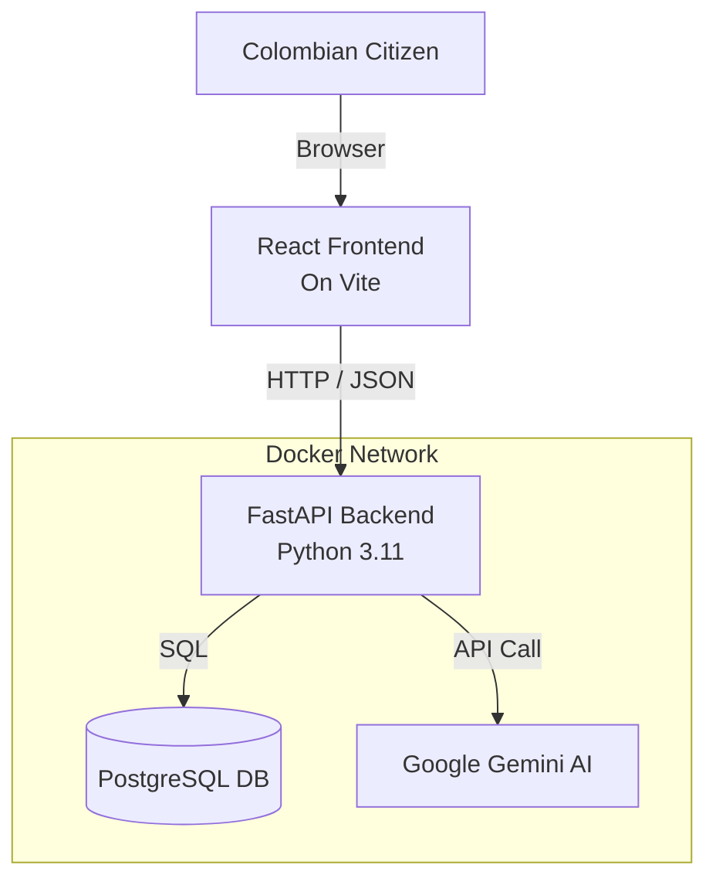

# 🏗️ Technical Documentation

## Architecture Overview

JustiBot follows a **Microservices-ready** architecture, although typically deployed as a modular monolith in Docker for simplicity.

### Components
1.  **Frontend (UI)**: Built with **React 19** and **TailwindCSS**. It uses a "Wizard" pattern to guide users step-by-step through the legal data collection process without overwhelming them.
2.  **Backend (API)**: Built with **FastAPI**. It handles validation, communicates with the Database, and orchestration of the AI prompts.
3.  **Database**: **PostgreSQL**. Stores the "Cases" (generated documents) so users can retrieve them later.
4.  **AI Engine**: **Google Gemini**. We use the `google-generativeai` SDK to communicate with the LLM.

---

## 🗄️ Database Schema

The database is designed to be simple but effective. The core entity is the `LegalCase`.

| Field | Type | Description |
| :--- | :--- | :--- |
| `id` | UUID | Unique identifier for the case. |
| `title` | String | Auto-generated title (e.g., "Acción de Tutela - Salud"). |
| `case_type` | Enum | `tutela` or `derecho_peticion`. |
| `description` | Text | The user's original story/complaint. |
| `generated_text` | Text | The full legal document generated by AI. |
| `created_at` | Timestamp | When the case was created. |

---

## 🔌 API Reference
Once the backend is running, you can access the full interactive documentation (Swagger UI) at:

> **[http://localhost:8000/docs](http://localhost:8000/docs)**

### Key Endpoints
*   `POST /api/v1/cases/generate`: Receives the user story and returns the legal document.
*   `GET /api/v1/cases/{id}`: Retrieves a previously generated document.
*   `GET /health`: System health check.
